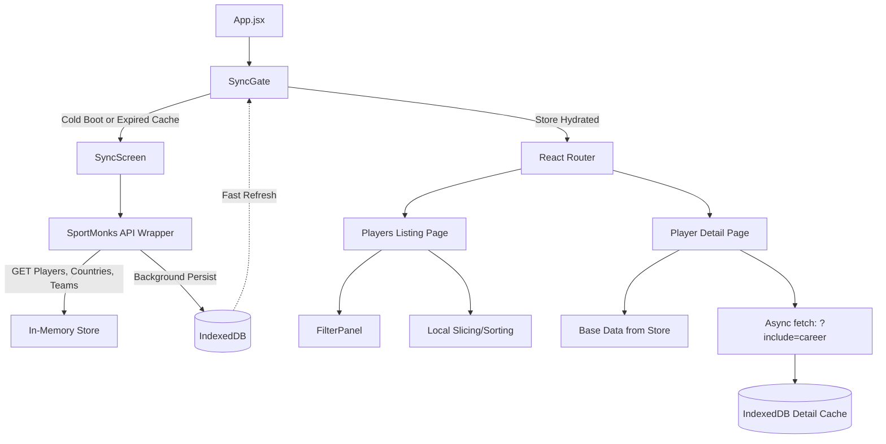

# Cricket Scouter — Professional Player Scouting Directory

A high-performance, enterprise-grade React application for browsing and analyzing cricket players. Built on top of the SportMonks API, this project emphasizes robust frontend architecture, advanced caching strategies, and a premium "Broadcaster/Scouting" aesthetic.

---

## Table of Contents

- [Cricket Scouter — Professional Player Scouting Directory](#cricket-scouter--professional-player-scouting-directory)
  - [Table of Contents](#table-of-contents)
  - [Project Structure](#project-structure)
  - [Architecture \& Data Lifecycle](#architecture--data-lifecycle)
  - [1. Design System \& UI](#1-design-system--ui)
  - [2. User Experience (UX)](#2-user-experience-ux)
  - [3. Development \& Architecture](#3-development--architecture)
    - [Performance \& Data Handling](#performance--data-handling)
    - [React Concepts \& Architecture](#react-concepts--architecture)
  - [4. SEO \& Accessibility](#4-seo--accessibility)

---

## Project Structure

```text
src/
├── api/                # Network layer & API wrappers (client, bootsrap, players)
├── components/         # Modular feature components
│   ├── common/         # Error, Empty, and Loading states
│   ├── detail/         # Player detail specific components (Hero, Radar, Career table)
│   ├── layout/         # Shell components (Header, Sidebar)
│   ├── listing/        # Directory components (Grid, Filters, Search, Pagination)
│   └── sync/           # Loading ritual (SyncScreen)
├── hooks/              # Custom React hooks (useUrlState, usePlayerDetail, etc.)
├── pages/              # Route level components
├── store/              # In-memory scalable state management
├── styles/             # Vanilla CSS, strictly following BEM & token conventions
│   ├── tokens.css      # Single source of truth for colors, spacing, typography
│   └── components/     # Component-scoped CSS files
└── utils/              # Pure functions (IndexedDB wrapper, data formatters, sanitizers)
```

---

## Architecture & Data Lifecycle



---

## 1. Design System & UI

This application features a highly intentional, "Sports Broadcaster" aesthetic—favoring a dark, high-contrast palette meant to mimic professional analytics terminals.

- **Typography & Visual Hierarchy**: Utilizing Google Font pairings with `Space Grotesk` for premium, imposing headings and `Inter` for hyper-legible tabular data. Foundational tokens (`tokens.css`) strictly control all sizing, meaning no ad-hoc or magic numbers exist in the CSS.
- **Component Consistency**: Pure vanilla CSS is favored over utility frameworks out of architectural choice, adhering closely to BEM-adjacent naming conventions (e.g., `.player-card`, `.player-card__image`). Component-scoped CSS files prevent selector bleeding.
- **Responsive Strategy (Mobile-First)**: Employs fluid scale spacing (`clamp(...)` functions in tokens) allowing the app to organically resize across viewports. Breakpoints orchestrate structural shifts—such as moving from a floating mobile filter bottom sheet to a permanently docked desktop sidebar at `≥ 1280px`.

The Initial UI was scaffolded via Google Stitch:

Project Link: https://stitch.withgoogle.com/projects/9555329754637782392

Prototype Scaffold Link: https://stitch.withgoogle.com/preview/9555329754637782392?node-id=f4e4e171282149df877b3f41cadb013a

---

## 2. User Experience (UX)

The UX moves beyond surface-level requirements into intentional, polished micro-interactions. Every interaction has weight.

- **The Loading Experience**: Faced with an unavoidable ~8s full-dataset API dump (given API pagination constraints), the `SyncScreen` turns a loading delay into a feature. It renders a "Synchronizing Data" boot sequence ritual, complete with an accurate progress bar and a rotating trivia stream—turning frustration into theater.
- **Skeletons over Spinners**: Navigating to a `PlayerDetailPage` employs a two-phase progressive render mechanism. Phase 1 pulls demographic data instantly from the local store with zero layout shift. Phase 2 fetches deep career statistics, wrapping the right-hand column in Discord-style shimmer skeletons until resolution.
- **Player Card Interactions**: Detailed hover states exist on player profile images in the directory (greyscale shifting to full color) signaling interactivity.
- **Error & Empty States**: Extensive error bounding. The `ErrorBoundary.jsx` avoids white-screens-of-death, instead showing themed broken-data UI. API Failures (like Rate Limiting or 401s) are gently intercepted by `client.js` with retry directives. Navigating to missing players displays a branded 404.
- **Share Functionality**: Integrating the `navigator.share` API directly into `PlayerHero`. Users clicking the share icon fire mobile-native sharing menus, with clipboard copy fallbacks and temporary "Copied!" badge feedback.

---

## 3. Development & Architecture

### Performance & Data Handling

The SportMonks Cricket v2 API presents a challenging constraint: the `/players` endpoint returns all ~60,000 records simultaneously without pagination. Instead of crippling the client, the architecture implements a **"Fetch Once, Own Everything"** philosophy.

1. **CORS proxy via Vite**: The `vite.config.js` routes API requests cleanly through a local proxy to sidestep CORS violations seamlessly during dev.
2. **IndexedDB over LocalStorage**: Since a 60k JSON response exceeds the 5-10MB limit of `sessionStorage`, a lightweight, dependency-free wrapper (`utils/idb.js`) manages an IndexedDB layer.
3. **Multi-layer Caching**:
   - **Global Registry Fast-Boot**: The full player/country/team dump is cached in IDB with a 24-hour TTL, making subsequent app launches immediate.
   - **Progressive Detail Cache**: Enriched player details with career data get stored under `player_detail_{id}` with a 2-hour TTL.
   - **In-Memory Store**: `store/players.js` acts as the immediate sliceable truth layer. Filtering/Sorting functions run highly-optimized `slice()` and `filter()` commands purely in memory (clocking at ~10ms operations natively).

### React Concepts & Architecture

The application balances modern functional patterns with strategic architectural decisions to handle massive datasets and high-fidelity animations.

- **Functional & Class Components**: The majority of the UI uses modern Functional Components. However, **Class Components** are leveraged for `ErrorBoundary.jsx` to implement the `getDerivedStateFromError` lifecycle, ensuring runtime safety across page boundaries.
- **Custom Hooks Architecture**: Logic is decoupled from the UI into specialized, reusable hooks:
  - `useUrlState`: Manages bidirectional synchronization between complex filter objects and the browser's `URLSearchParams`.
  - `usePlayerDetail`: Orchestrates a two-phase async lifecycle (instant base-data hydration followed by deep-object enrichment).
  - `useDebounce`: Optimized for performance to prevent expensive re-sorts during active search input.
- **State Management Strategy**:
  - **Local State**: `useState` and `useReducer` handle localized UI transitions (modal states, sync progress).
  - **Module-Level Global Store**: To avoid the overhead of React's reconciliation cycle for 60,000 records, the primary player registry resides in a module-level JavaScript store (`store/players.js`), with React components deriving "slices" on demand.
- **Lifecycle & Sync Gate**: The `SyncGate` pattern ensures that the application only enters its interactive state once the background synchronization ritual (`SyncScreen.jsx`) has successfully hydrated the local IndexedDB cache and in-memory store.
- **Focus & Accessibility Management**: Using `useRef` to manage focus shifts between route transitions, ensuring meaningful navigation for screen reader users.
- **Declarative Routing (V6)**: Dynamic paths like `/players/:id` are handled via `react-router-dom` with active `document.title` synchronization.

---

## 4. SEO & Accessibility

Although purely single-page, progressive enhancements mirror traditional multi-page SEO accessibility.

- **URL Shareability**: Relying strictly on React Router params and URL State hooks, a user could copy the exact URL (complete with their active search terms, country filters, and pagination state) and drop it to a colleague, retaining flawless application state.
- **Meta & Title Sync**: Entering a `PlayerDetailPage` actively updates `document.title` and injects `og:title` / `meta[name="description"]` tags based on the loaded player, producing richer link cards when shared externally or scraped.
- **Accessibility Fundamentals**:
  - ARIA landmarks (`aria-busy`, `aria-label`, `role="progressbar"`) mapped extensively across interactive elements.
  - Valid Semantic HTML: Lists utilize `<article>` wrappers, and headers sequentially follow `h1`, `h2` structure.
  - Keyboard navigability remains intact with specific `tabIndex` focus management rules implemented when route histories shift.
